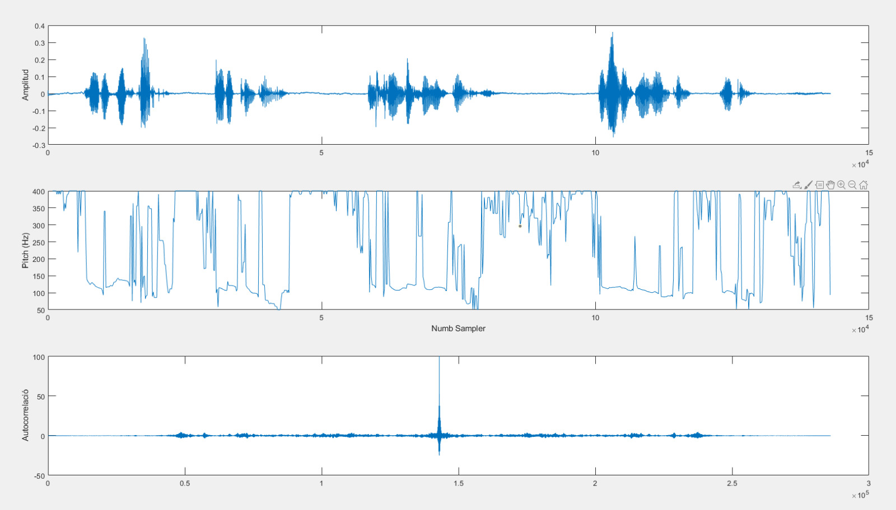
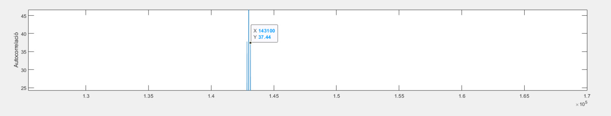
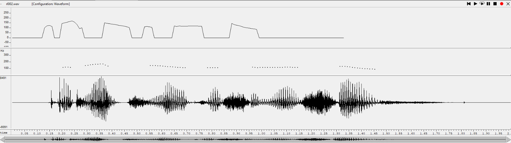
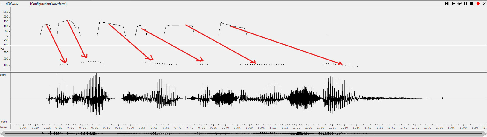

PAV - P3: detección de pitch
============================

Esta práctica se distribuye a través del repositorio GitHub [Práctica 3](https://github.com/albino-pav/P3).
Siga las instrucciones de la [Práctica 2](https://github.com/albino-pav/P2) para realizar un `fork` de la
misma y distribuir copias locales (*clones*) del mismo a los distintos integrantes del grupo de prácticas.

Recuerde realizar el *pull request* al repositorio original una vez completada la práctica.

Ejercicios básicos
------------------

- Complete el código de los ficheros necesarios para realizar la detección de pitch usando el programa
  `get_pitch`.

   * Complete el cálculo de la autocorrelación e inserte a continuación el código correspondiente.
	La autocorrelación es una operación matemática consistente en correlar una señal con ella misma desplazada. Los valores que
	no pertenecen los dejamos en "zero-padding".
	
	CÓDIGO:
	
	  void PitchAnalyzer::autocorrelation(const vector<float> &x, vector<float> &r) const {
	   for (unsigned int l = 0; l < r.size(); ++l) {
	      /// \TODO Compute the autocorrelation r[l]
	      r[l] = 0;
	      for(unsigned int i = l; i < x.size()-l; ++i ){
		r[l] += x[i-l]*x[i];
	      }
	      r[l] = r[l]/(r.size()-l);
	      }
	    if (r[0] == 0.0F) //to avoid log() and divide zero 
	      r[0] = 1e-10; 
	  }
	
	  void PitchAnalyzer::set_window(Window win_type) {

	    if (frameLen == 0)
	      return;
	    window.resize(frameLen);
	    switch (win_type) {
	    case HAMMING:
	      {
		unsigned int n;
		float a = 0.5432; //Información obtenida de internet
		float b = 0.4592; //Ídem

		for(n=0; n < frameLen; n++){
		  window[n] = a - b*cos(2*M_PI*n/(frameLen-1));
		}
	      }
	      /// \TODO Implement the Hamming window

	      break;
	    case RECT:
	      {
		unsigned int i;
		for(i = 0; i < frameLen ; i++){
		  window[i] = 1/frameLen;
		}
	      }
	      break;
	    default:
	      window.assign(frameLen, 1);
	      break;
	    }
	  }
	Hemos incluido el código del eventanado en esta sección ya que tiene relación directa con la resta del procesado.

   * Inserte una gŕafica donde, en un *subplot*, se vea con claridad la señal temporal de un sonido sonoro
     y su periodo de pitch; y, en otro *subplot*, se vea con claridad la autocorrelación de la señal y la
	 posición del primer máximo secundario.

	 NOTA: es más que probable que tenga que usar Python, Octave/MATLAB u otro programa semejante para
	 hacerlo. Se valorará la utilización de la librería matplotlib de Python.
	 
	 Hemos realizado este apartado con MATLAB con el siguiente código: 

	 Para programarlo se han usado funciones propias de la librería "Audio toolbox"
	 de MATLAB. 
		 
		 CÓDIGO:
		 
		clc;
		clear all;
		close all;
		fs = 16000;
		[audioIn, fs] = audioread("pav_2321.wav");
		[f0, idx] = pitch(double(audioIn), fs);

		[cor,l] = xcorr(audioIn);

		subplot(3,1,1)
		plot(audioIn)
		ylabel('Amplitud')

		subplot(3,1,2)
		plot(idx,f0)
		ylabel('Pitch (Hz)')
		xlabel('Numb Sampler')

		subplot(3,1,3)
		plot(cor)
		ylabel('Autocorrelació')
	
		
	

   * Determine el mejor candidato para el periodo de pitch localizando el primer máximo secundario de la
     autocorrelación. Inserte a continuación el código correspondiente.
     
    	Para determinar el valor hemos usado los valores deducibles de las lecturas para realizar la práctica y de las 
	gráficas que nos presenta matlab i wavesurfer.
		
		CÓDIGO:
		
		 float PitchAnalyzer::compute_pitch(vector<float> & x) const {
		    if (x.size() != frameLen)
		      return -1.0F;

		    //Window input frame
		    for (unsigned int i=0; i<x.size(); ++i)
		      x[i] *= window[i];

		    vector<float> r(npitch_max);

		    //Compute correlation
		    autocorrelation(x, r);

		    vector<float>::const_iterator iR = r.begin(), iRMax = iR; //, iREnd = r.end();

		    /// \TODO 
			/// Find the lag of the maximum value of the autocorrelation away from the origin. 
			/// Choices to set the minimum value of the lag are:
			///    - The first negative value of the autocorrelation.
			///    - The lag corresponding to the maximum value of the pitch.
		    ///	   .
			/// In either case, the lag should not exceed that of the minimum value of the pitch.

		    /*Asignaremos unos límites superior e inferior a las frecuencias del pitch, 
		    a base de prueba y error vemos los valores que mejor resultado dan son 60 y 235, de base partimos de 60 y 400.
		    ANOTACIÓN: max_element retorna el valor máximo de un vector cuyo rango está contenido entre (A y B),
		    en este caso A=r.begin()+f_min, y B=r.begin()+f_max*/

		    unsigned int lag = iRMax - r.begin();
		    unsigned int f_min = 60, f_max = 235;

		    lag=max_element(r.begin()+f_min, r.begin()+f_max)-r.begin();
		    float pot=10*log10(r[0]);   

		    //You can print these (and other) features, look at them using wavesurfer
		    //Based on that, implement a rule for unvoiced
		    //change to #if 1 and compile
		    #if 0 
		    if (r[0] > 0.0F)
		      cout << pot << '\t' << r[1]/r[0] << '\t' << r[lag]/r[0] << endl;
		    #endif
		    if (unvoiced(pot, r[1]/r[0], r[lag]/r[0]))
		      return 0;
		    else
		      return (float) samplingFreq/(float) lag;
		  }
		 }
		

   * Implemente la regla de decisión sonoro o sordo e inserte el código correspondiente.
   
	 CÓDIGO:
	 
	 bool PitchAnalyzer::unvoiced(float pot, float r1norm, float rmaxnorm) const {
	    /// \TODO Implement a rule to decide whether the sound is voiced or not.
	    /// * You can use the standard features (pot, r1norm, rmaxnorm),
	    ///   or compute and use other ones.
	    if((pot < -39 || r1norm <= 0.83) && rmaxnorm < 0.55){
	      return true;
	    }    
	    else{
	      return false;
	    }
	  }

- Una vez completados los puntos anteriores, dispondrá de una primera versión del detector de pitch. El 
  resto del trabajo consiste, básicamente, en obtener las mejores prestaciones posibles con él.

	Para conseguir los mejores valores posibles para nuestro código hemos cogido los valores igual que en el apartado
	anterior. Para ajustarlos aún más, alrededor de los valores calculados hemos ido subiendo o bajándolos en un 
	margen lógico para mejorar el rendimiento de nuestro código, ya que los cáclulos y visionados de lecturas y gráficas
	no son los mismos que en la práctica.
	

  * Utilice el programa `wavesurfer` para analizar las condiciones apropiadas para determinar si un
    segmento es sonoro o sordo. 
	
	  - Inserte una gráfica con la detección de pitch incorporada a `wavesurfer` y, junto a ella, los 
	    principales candidatos para determinar la sonoridad de la voz: el nivel de potencia de la señal
		(r[0]), la autocorrelación normalizada de uno (r1norm = r[1] / r[0]) y el valor de la
		autocorrelación en su máximo secundario (rmaxnorm = r[lag] / r[0]).

		Puede considerar, también, la conveniencia de usar la tasa de cruces por cero.

	    Recuerde configurar los paneles de datos para que el desplazamiento de ventana sea el adecuado, que
		en esta práctica es de 15 ms.

		

      - Use el detector de pitch implementado en el programa `wavesurfer` en una señal de prueba y compare
	    su resultado con el obtenido por la mejor versión de su propio sistema.  Inserte una gráfica
		ilustrativa del resultado de ambos detectores.
  		
			

		Adjuntamos dos gráficas, la original y una editada donde se ve la correspondencia de los lóbulos de la función 
		calculada por nosotros y el "pitch contour" de wavesurfer. Hay un offset entre ambas, mas claramente se observa
		la correspondencia, tanto por tamaño como por variación de los picos que ofrece "pitch contour".
		
  		
  
  * Optimice los parámetros de su sistema de detección de pitch e inserte una tabla con las tasas de error
    y el *score* TOTAL proporcionados por `pitch_evaluate` en la evaluación de la base de datos 
	`pitch_db/train`..
	
	Evaluación *ciega* del detector
-------------------------------
Los resultados finales de nuestro detector tras la realización de los ejercicios es:
Si usamos un filtro de mediana con 3 muestras da:
### Summary
Num. frames:	11200 = 7045 unvoiced + 4155 voiced
Unvoiced frames as voiced:  	251/7045 (3.56 %)
Voiced frames as unvoiced:  	422/4155 (10.16 %)
Gross voiced errors (+20.00 %): 219/3733 (5.87 %)
MSE of fine errors: 	2.95 %

===>	TOTAL:  89.66 %
--------------------------

Si usamos un filtro de mediana con 5 muestras da:
### Summary
Num. frames:	11200 = 7045 unvoiced + 4155 voiced
Unvoiced frames as voiced:  	244/7045 (3.46 %)
Voiced frames as unvoiced:  	427/4155 (10.28 %)
Gross voiced errors (+20.00 %): 186/3728 (4.99 %)
MSE of fine errors: 	3.31 %

===>	TOTAL:  89.50 %
--------------------------

Aunque el total es mejor con un filtro de 3 muestras hay que mencionar que el Gross voiced errors es un poco mejor cuando el filtro es de 5 muestras.

   * Inserte una gráfica en la que se vea con claridad el resultado de su detector de pitch junto al del
     detector de Wavesurfer. Aunque puede usarse Wavesurfer para obtener la representación, se valorará
	 el uso de alternativas de mayor calidad (particularmente Python).
	 
	

   

Ejercicios de ampliación
------------------------

- Usando la librería `docopt_cpp`, modifique el fichero `get_pitch.cpp` para incorporar los parámetros del
  detector a los argumentos de la línea de comandos.
  
  Esta técnica le resultará especialmente útil para optimizar los parámetros del detector. Recuerde que
  una parte importante de la evaluación recaerá en el resultado obtenido en la detección de pitch en la
  base de datos.

  * Inserte un *pantallazo* en el que se vea el mensaje de ayuda del programa y un ejemplo de utilización
    con los argumentos añadidos.

- Implemente las técnicas que considere oportunas para optimizar las prestaciones del sistema de detección
  de pitch.

  Entre las posibles mejoras, puede escoger una o más de las siguientes:

  * Técnicas de preprocesado: filtrado paso bajo, *center clipping*, etc.
 
  	*LPF*: usar un filtro paso bajo lineal nos empeora la detección, ya que "se come" muchas frecuencias necesarias para
	distinguir entre sonidos. 
	Código de nuestra implementación NO usada en el programa definitivo:
	
	*Center Clipping*: esta técnica nos dá una mejora visible de resultado. El código usado es el siguiente:

	CÓDIGO:
	
	  //Low Pass Filter --> no funciona
	  //Filtro promediador sacado de wikipedia: 1/A*(x[n]+x[n-1]) donde alfa=1/A
	  /*float alfa = 0.89; 
	  for(unsigned int p_bajo = 2; p_bajo < x.size(); ++p_bajo){
	    x[p_bajo]= alfa*x[p_bajo] + (1-alfa)*x[p_bajo-1]; 
	  }*/
	  
	 //Centre-clipping sin offset --> mejora entre un 5% y 7% el total
	 /* float val_max=*max_element(x.begin(),x.end());
	  float th_clip=0.058*val_max;
	  unsigned int i;

	  for(i=0;i<x.size();i++){
	    if(abs(x[i])<=th_clip)
	      x[i]=0;
	  }*/

	  //Centre-clipping con offset --> mejora un poco el total respecto la variante sin offset
	  float val_max=*max_element(x.begin(),x.end());
	  float th_clip=0.0485*val_max;
	  unsigned int i;

	  for(i=0;i<x.size();i++){
	    if(x[i]>th_clip){
	      x[i]=x[i]-th_clip;
	    } 
	    else if(x[i]<-th_clip){
	      x[i]=x[i]+th_clip;
	    }  
	    else{
	      x[i]=0;
	    }     
	  }
	
	El filtro paso bajo no lo usamos dado que afecta negativamente al resultado final, tanto el clipping con o sin offset dan buenos resultados pero elegimos el clipping con offset porqué da unas decimas más en el porcentaje total final.
	
  * Técnicas de postprocesado: filtro de mediana, *dynamic time warping*, etc.
  
  	*Median filter*: para terminar de mejorar nuestro programa hemos querido usar un filtro de mediana. Al tratarse de un 
	filtro paso bajo no lineal consideramos que mejora suficiente nuestro código para ser implementado en la versión final.
	
	Para programarlo nos hemos basado en el conocimiento de clase y estas 2 webs:
	https://www.geeksforgeeks.org/noise-removal-using-median-filter-in-c/
	http://ceur-ws.org/Vol-1543/p1.pdf
	
	//Median filter

	  int fil_size = 5; //Número que nos dá mejor F_Score
	  int fil_center = fil_size/2;
	  float v[fil_size]; 
	  for(unsigned int i = fil_center; i < f0.size()-fil_center; i++){
	    //i es la posición que ha de recorrer por todo el vector f0
	    for(int mediana = -fil_center; mediana <= fil_center; mediana++){
	      v[mediana + fil_center] = f0[i + mediana];
	    }
	    //ordenamos los valores y hacemos la mediana
	    sort(v, v+fil_size);
	    //Cogemos el valor central y lo ponemos en lugar de estas muestras
	    f0[i] = v[fil_center];
	  }
	
  * Métodos alternativos a la autocorrelación: procesado cepstral, *average magnitude difference function*
    (AMDF), etc.
  * Optimización **demostrable** de los parámetros que gobiernan el detector, en concreto, de los que
    gobiernan la decisión sonoro/sordo.
  * Cualquier otra técnica que se le pueda ocurrir o encuentre en la literatura.

  Encontrará más información acerca de estas técnicas en las [Transparencias del Curso](https://atenea.upc.edu/pluginfile.php/2908770/mod_resource/content/3/2b_PS Techniques.pdf)
  y en [Spoken Language Processing](https://discovery.upc.edu/iii/encore/record/C__Rb1233593?lang=cat).
  También encontrará más información en los anexos del enunciado de esta práctica.

  Incluya, a continuación, una explicación de las técnicas incorporadas al detector. Se valorará la
  inclusión de gráficas, tablas, código o cualquier otra cosa que ayude a comprender el trabajo realizado.

  También se valorará la realización de un estudio de los parámetros involucrados. Por ejemplo, si se opta
  por implementar el filtro de mediana, se valorará el análisis de los resultados obtenidos en función de
  la longitud del filtro.
  
  
   
*CONCLUSIONES*
--------------
Hemos conseguido realizar un detector con un F_Score suficientemente bueno (89.66%), habiendo sido capaces 
esta vez de entender mucho mejor la práctica realizando los ejercicios opcionales y aprendiendo un poco más 
del paradigma de C++. Además, las gráficas las hemos realizado en MATLAB, consiguiendo no dejar en un cajón
los conocimientos que ambos tenemos de ese programa. 
Como siempre, las partes que más nos ha costado de la práctica han sido dominar el uso del terminal, que 
nos lleva siempre el tiempo equivalente a la primera sesión junto con leerse la documentación. El segundo
problema ha sido entender el código que teníamos previo a nuestra implementación para poder sacarle todo su 
partido.
En general, esta práctica nos ha ido mejor que la anterior, habiendo entendido mejor el código. 

Antes de realizar el *pull request* debe asegurarse de que su repositorio contiene los ficheros necesarios
para compilar los programas correctamente ejecutando `make release`.

Con los ejecutables construidos de esta manera, los profesores de la asignatura procederán a evaluar el
detector con la parte de test de la base de datos (desconocida para los alumnos). Una parte importante de
la nota de la práctica recaerá en el resultado de esta evaluación.
